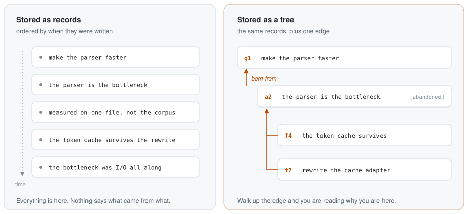
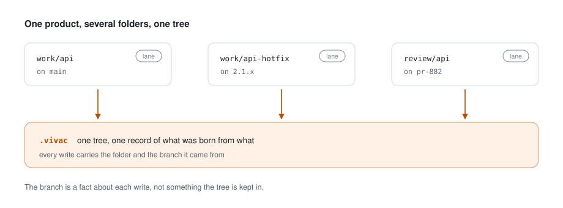

<div align="center">

# vivac

**A tree where every node knows which node it was born from.**

*So that months later something can still answer “why are we here?”*

[](https://github.com/JAAvila-Of/vivac/actions/workflows/ci.yml)
[](https://crates.io/crates/vivac)
[](rust-toolchain.toml)
[](#licence)

</div>

```
$ vivac why 4

  Why we are here  ->  t4
  ------------------------------------------------------------------

  g1    Ship the 2.0 API
        the first customer is waiting on it
        (4 open / 1 closed below)
        |
        v
  t2    Replace the cache adapter
        the session bug traces back to it
        (3 open / 1 closed below)
        |
        v
  t4    No test for expiry  [closed]
        no way to reproduce the session bug
        ! the corpus run is what settled it
        = reproduced: sessions expire at 300s, not 3600

        ^^^ you are here

  In parallel, still open (3):
      t3     Rate limiting is undecided
      d5     Retry policy: three tries, then fail loudly
      t6     Migrate the callers

  t2 does not close until these close (1):
      t6     Migrate the callers
```

<div align="center">

**[What you get](#what-you-get)** · **[Install](#install)** · **[First five minutes](#the-first-five-minutes)** · **[Why one map](#one-map)** · **[Bring a project in](docs/MIGRATING.md)**

</div>

---

## Built for one person's own work

One person wrote this for their own projects, and it is still measured on
them. That is the whole of its pedigree, and it shows in what got built:
every mechanism here came out of a defect that had already cost its author
days, and every number on this page came off a real tree rather than a
benchmark written to make a README look good.

The tree this project keeps of itself, 23 days in: **695 nodes, 315 of them
closed, 176 standing decisions, 16 levels deep.**

Three of those defects, and what each one turned into:

- **A run marked `DONE` with its findings still open** — and 26 days before
  anybody noticed. Now `vivac done` refuses, and says what is missing.
- **A reading list of 109 open fronts across 224 lines**, with the one
  touched yesterday at the bottom. Now `open` answers *what is waiting on
  you*, in that order, and stops at ten.
- **Three claims shipped to crates.io that the binary beside them
  contradicted.** Now a test runs every command this page shows and holds its
  lists against `--help`.

There are no issues and no pull requests yet; [`CONTRIBUTING.md`](CONTRIBUTING.md)
says why.

---

## The problem

When you develop with an agentic AI, work spawns more work. Three hops in, you
have lost the thread of what you originally set out to do.

It is not a memory problem: usually everything is written down. **It is a
provenance problem.** What is written does not say what it was born *from*,
and without that edge there is no way to reconstruct why you are where you
are.

> Measured on a real compiler: the path between the goal and the day's work
> was **six levels deep**, spread across a chronologically ordered 8,853-line
> tracker, 52 planning documents and 21 issues. The structure was temporal,
> which is exactly the opposite of provenance.

<picture>
  <source media="(prefers-color-scheme: dark)" srcset="docs/img/edge-dark.svg">
  
</picture>

Logbooks, decision records, issue trackers and session memory for agents all
store the **node**. None of them stores the **edge**.
[Where it sits](docs/POSITION.md) goes through them category by category, and
says where each one is better than this.

---

## What you get

**The agent starts oriented, and nobody has to ask it to.** A hook runs
`vivac session start` when a session opens, so the first thing in its context
is where you are, what has already been decided, and what not to touch:

```
$ vivac brief

vivac · project: demo · lane: main · 2026-09-21
------------------------------------------------------------

 GOAL g1     Ship the 2.0 API
  |
  |-- t2     Replace the cache adapter
  |     why: the session bug traces back to it
  |
  `-- t6     Migrate the callers   <== HERE
        why: the old adapter had a different signature

 STANDING DECISIONS
  d5     Retry policy: three tries, then fail loudly

 LAST VIVAC
  v5 · push · 2026-09-21 · bcdba21
         you were about to: Migrate the callers

------------------------------------------------------------
 143 tokens · depth 3 · 0 parked
```

**In tokens, that is the whole argument.** A project keeping its state in
three places was asked to pick up where it left off. A hand-written plan
answered in **9,252 tokens**. A memory system answered *“maybe”* in about
**12,720**, depending on which of two names for the project it resolved. The
tree answered in **100**. The brief carries a token budget because a context
window is the one resource every session spends.

**Nothing closes over what is still open.** The one operation in the model
that rejects, and it earns it: a run marked done over open findings took 26
days to be spotted once.

```
$ vivac done 2

  t2 CANNOT close: 1 open closure condition(s)

      t6     Migrate the callers

  A run closes with its findings, not with its report.
  Closing it anyway leaves a trace:  vivac done 2 --force
```

**Every decision keeps what it turned down**, and what it was judged against.
`--alternative` holds the option rejected, `--supersedes` links a reversal to
what it reverses, and `--against` records the rule or pillar that decided it —
so a decision can be argued with a year later instead of guessed at. This
project's own tree carries 176 of them.

**And you can look at the whole thing.** `vivac web` draws the tree in a
browser: which project moved and which has been sitting still, one node's
lineage, and what changed under you while you were not asking. A server you
start and that dies when you close it, bound to `127.0.0.1`, reachable
through a one-time key it prints.

**An assumption that falls does not take its children with it.** `abandon`
marks the premise refuted and everything under it goes with it, except what
you rescue — and what is rescued **still hangs where it was born**, because
being born somewhere is not undone by that place turning out to be wrong.

---

## One map

**Do not run vivac beside another memory or learning system in the same
project.** Not because they compete — because **two maps collide.** Each one
points the agent at the context it holds, and sooner or later one settles
something the other mapped differently, with nobody noticing which of the two
oriented the decision.

That is observed, not assumed:

- **A written rule can create a seat no tool can read.** In one project an
  instruction told the agent to mirror every update into its memory system.
  That made three seats at the table, and the one that actually governed was
  the only one nothing could inspect.
- **The harness brings its own map, whether you chose it or not.** In the
  project that builds vivac — with everything else deliberately turned off,
  precisely to test whether the tree alone could carry the thread — the
  harness's automatic memory kept injecting a copy of the project's doctrine
  into every session **for five days** before anybody noticed. The measurement
  was not wrong. It was invalid, and nothing said so.

### So why not just the harness?

It gives you the session. It does not give you three things, and each absence
is a specific failure rather than a missing feature:

- **No edge.** It stores what was learned, not which piece of work it came out
  of, so there is nothing to walk back along.
- **No focus.** Everything recalled is equally present, and none of it says
  *you are here* — or, more to the point, *do not touch that*.
- **No open and closed state.** Nothing can be reported as still missing.

And **the harness's memory belongs to the harness.** Change tool and the
thread does not come with you. `.vivac/` is a file in your project: plain JSON
lines, exportable in one command, readable without this binary.

vivac turns nothing off, and neither does setup — another system is not
vivac's to touch. What it gives you is a skill that finds every other map the
agent receives and offers to retire each one, after you say yes, in a form
that can be undone.

---

## What it costs

Budgets, not aspirations: a read is given **50 ms** and a write **5 ms**, and
where that is missed it is named rather than left out.

Measured on 18 September 2026 at **ten thousand nodes**, 200 calls per cell,
on two machines and at two tree shapes, because what `brief` and `open` cost
is governed by how many fronts are still open rather than by how many nodes
exist. p99 in milliseconds:

| | `brief` | `why` | `open` | `find` |
|---|---|---|---|---|
| **CLI**, cold process, Linux | 15.5 | 18.8 | 20.4 | 19.9 |
| **MCP**, resident server, Linux | 0.5 | 7.1 | 4.2 | 8.8 |

A write over MCP is **0.6 ms at p99** and flat in the size of the tree. And
because context is the budget that actually binds, the payloads are measured
too: `vivac_open` over ten thousand nodes went from 1,993,053 bytes to
**599,012**, and `why --json` on a deep node from 86,894 to **7,139**.

→ [**The full numbers**](docs/PERFORMANCE.md) — both machines, both tree
shapes, the write table, and what Windows misses and why.

---

## What it never stores

A provenance tree is a map of where a system is weak and not yet fixed, which
forces a few things that are not negotiable:

- **No keys and no secrets.** A redaction guard at write time. In doubt it
  refuses and says why; it never stores in silence.
- **No personal data.** No email, no name, no home path. The `actor` on every
  event is an opaque identifier.
- **No file contents.** Only paths, references and prose about what was
  decided — so a leak bounds to *what was being worked on*, never to *what the
  code is*.
- **No telemetry.** The binary does not phone home. Ever.

These come from the [pillars](docs/PILLARS.md): **security vetoes, performance
budgets, UX proves a surface is worth reading, DX judges.**

---

## Install

Every [release](https://github.com/JAAvila-Of/vivac/releases) carries a
precompiled binary — Linux and macOS on `x86_64` and `aarch64`, Windows on
`x86_64` — listed in `SHA256SUMS` and carrying signed build provenance.
Unpack one and put `vivac` on your `PATH`.

With a Rust toolchain, 1.89 or newer:

```sh
cargo install vivac
```

`cargo install` is not the fallback: it builds from the source published to
crates.io, so it stays the auditable path for anyone who cares about the
supply chain of a tool that reads their work.
→ [**Setting it up**](docs/SETUP.md)

---

## The first five minutes

**1.** In the folder you open your agent in. It shows every file it will
touch and the exact command each hook will run, and then it asks:

```sh
vivac setup claude-code
```

**2.** Start the first thread. You were going to say what you are doing
anyway; saying it here is what creates the edge, for free:

```sh
vivac push "Replace the cache adapter" --why "the session bug traces back to it"
vivac push "No test for expiry" --why "no way to reproduce it" --blocks
vivac pop "reproduced: sessions expire at 300s, not 3600"
```

**3.** Ask where you are, and why:

```sh
vivac brief        where you are, and what NOT to touch
vivac why 2        the path from the root, narrated
vivac open         what is waiting on you, and what has been sitting
vivac web          the whole tree in a browser, on this machine only
```

That is the loop. → [**Every command**](docs/USAGE.md)

---

## Bringing a project in

> **Nothing moves into vivac on its own.**

If your project already keeps what it has learned — in a memory system, in
`CLAUDE.md`, `AGENTS.md`, `MEMORY.md`, the harness's own memory, or internal
documents — **none of that is in the tree after `vivac setup`.** vivac never
reads another system and never reads those files, because telling a rule from
the prose around it takes judgment, and a tool that guessed would fill your
tree with confident nonsense on day one.

So it is a job for the agent, with you deciding what goes in. setup installs
the `vivac-migrate` skill, and you say:

> Use the vivac-migrate skill to bring everything this project knows into
> vivac.

It lists every source it finds, asks which to bring in, shows a plan before
writing anything, checks what it wrote — and then offers to retire the other
maps, one at a time. **That last step is the point, not the tidying up:** a
full tree with the old records still talking to the agent is
[two maps](#one-map), which is the state this gets you out of.

→ [**Bringing a project in**](docs/MIGRATING.md)

---

## Lanes

You work on one product from more than one folder: a checkout on `main`, a
second one for a hotfix, a third for reviewing somebody else's branch. Or one
folder and ten branch changes a day.

**The record must not fork when the folders do.** *What was this born from?*
has one answer for the product, not one per checkout — three trees answering
it three ways is three wrong answers.

So the tree belongs to the **product**, and every folder that works on it is a
**lane**. The branch is a fact recorded on each write, not something the tree
is kept in.

<picture>
  <source media="(prefers-color-scheme: dark)" srcset="docs/img/lanes-dark.svg">
  
</picture>

What that buys you: the brief tells you when a branch moved under you, and
what the other lanes have done since you last wrote here.

| Your situation | What to run |
|---|---|
| another folder, under the same tree | `vivac setup claude-code` there too |
| a folder somewhere else entirely | `vivac setup claude-code --join <name>` |
| the tree should live elsewhere | `vivac relocate <destination>` |
| which lanes exist, and what each is on | `vivac stack --lanes` |

Read `codex` for `claude-code` wherever you use it, including in the same
folder as the other: the harness decides which files a folder gets, and never
anything about the tree.

→ [**`docs/LANES.md`**](docs/LANES.md) — what a lane is and is not, and the
four ways to get it wrong.

---

## Where this is measured

| | |
|---|---|
| **Claude Code** | `vivac setup claude-code` writes the hooks, the server and the skill. This is the harness every measurement on this page was taken on. |
| **Codex** | `vivac setup codex` leaves a project just as ready, where Codex reads it. A real Codex session was walked end to end on 22 September 2026: the server resolves once the project is trusted, the skill is offered to the model, the opening hook puts the brief into the agent's context, and the closing hook leaves its stop. It merges with what is already there, runs twice without writing anything the second time, and takes itself back — the same way the Claude Code side does, and through the same flags. |
| **Anything else** | The hooks call ordinary commands. Any harness that can run one when a session opens and put its output in the agent's context can call the same one, and any MCP client can run `vivac mcp`. |

One step of that walk is not measured and cannot be: approving each hook
inside Codex is something a person does, once, and looking at a person is not
a measurement.

Not there yet: team mode. The project is in `0.x` and
[**breaks on the minor**](docs/VERSIONING.md) while it is.

---

## Documentation

| | |
|---|---|
| [**Using it**](docs/USAGE.md) | every command, grouped by who runs it |
| [**Setting it up**](docs/SETUP.md) | what setup writes, Codex, the MCP server, where things are stored |
| [**Bringing a project in**](docs/MIGRATING.md) | the migration, and why it is a migration and not an addition |
| [**Lanes**](docs/LANES.md) | one product, several folders, one tree |
| [**What it costs**](docs/PERFORMANCE.md) | the full measurements, and how they were taken |
| [**Versioning**](docs/VERSIONING.md) | what breaks when, and what keeps `1.0` away |
| [**Where it sits**](docs/POSITION.md) | what each category of tool stores, and where each is better than this |
| [**Pillars**](docs/PILLARS.md) | the four arbiters every decision here is judged against |

## Licence

`MIT OR Apache-2.0`, at the option of whoever uses it. The text of each is in
[`LICENSE-MIT`](LICENSE-MIT) and [`LICENSE-APACHE`](LICENSE-APACHE).
